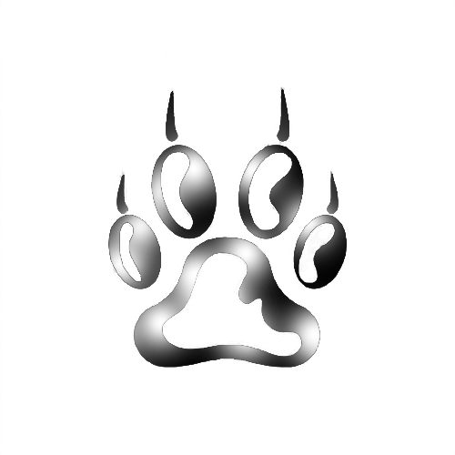

<div id="top"></div>
<!--
*** Thanks for checking out the catWalker. If you have a suggestion
*** that would make this better, please fork the repo and create a pull request
*** or simply open an issue with the tag "enhancement".
*** Don't forget to give the project a star!
*** Thanks again! Now go create something AMAZING! :D
-->


<!-- PROJECT SHIELDS -->
<!--
*** I'm using markdown "reference style" links for readability.
*** Reference links are enclosed in brackets [ ] instead of parentheses ( ).
*** See the bottom of this document for the declaration of the reference variables
*** for contributors-url, forks-url, etc. This is an optional, concise syntax you may use.
*** https://www.markdownguide.org/basic-syntax/#reference-style-links
-->
[![Contributors][contributors-shield]][contributors-url]
[![Forks][forks-shield]][forks-url]
[![Stargazers][stars-shield]][stars-url]
[![Issues][issues-shield]][issues-url]
[![MIT License][license-shield]][license-url]
[![LinkedIn][linkedin-shield]][linkedin-url]


<!-- PROJECT LOGO -->
<br />
<div align="center">
  <a href="https://github.com/NehemiahAklil/catWalker">
    
  </a>

<h3 align="center">Cat Walker</h3>

  <p align="center">
    Python Script to remove directory named executable virus 
    <br />
    <a href="https://github.com/NehemiahAklil/catWalker/issues">Report Bug</a>
    ·
    <a href="https://github.com/NehemiahAklil/catWalker/issues">Request Feature</a>
  </p>
</div>


<!-- ABOUT THE PROJECT -->
## About The Project

<!-- [![Product Name Screen Shot][product-screenshot]](https://example.com) -->
 This is a fun little script I wrote to help me remove one very annoying virus that will infect your USB drives in a matter of instance hope you like it and please give a star if you do.

<p align="right">(<a href="#top">back to top</a>)</p>


<!-- GETTING STARTED -->
## Getting Started

Here is how you may use the project locally.
To get a local copy up and running follow these simple example steps.

### Prerequisites

First things first you need to install python.
* python
  ```sh
  pacman -Syu python3
  ```
  ```
  sudo apt get python3
  ```
### Installation

1. First Install python as said above then
2. Clone the repo
   ```sh
   git clone https://github.com/NehemiahAklil/catWalker.git
   ```

<p align="right">(<a href="#top">back to top</a>)</p>


<!-- USAGE EXAMPLES -->
## Usage

Here is how you can use the script. Be cautious when using this script for because it iterates over every folder and sub-folder which might end up taking a lot more time even crash if the directory has too many files or sub folders espeacially be aware if your local machine is older.  

* Open the folder
    ```sh
    cd catWalker
    ```
* Use it to clean directoriy and its sub-directories by passing the folder name
  
    ```sh
    python3 catWalker.py <foldername> 
    ```
* Or just execute it and it will search the folder its in and its sub-directories
    ```sh
    python3 catWalker.py 
    ```
<p align="right">(<a href="#top">back to top</a>)</p>


<!-- CONTRIBUTING -->
## Contributing

Contributions are what make the open source community such an amazing place to learn, inspire, and create. Any contributions you make are **greatly appreciated**.

If you have a suggestion that would make this better, please fork the repo and create a pull request. You can also simply open an issue with the tag "enhancement".
Don't forget to give the project a star! Thanks again!

1. Fork the Project
2. Create your Feature Branch (`git checkout -b feature/AmazingFeature`)
3. Commit your Changes (`git commit -m 'Add some AmazingFeature'`)
4. Push to the Branch (`git push origin feature/AmazingFeature`)
5. Open a Pull Request

<p align="right">(<a href="#top">back to top</a>)</p>


<!-- LICENSE -->
## License

Distributed under the GNU v3.0 License. See `LICENSE` for more information.

<p align="right">(<a href="#top">back to top</a>)</p>


<!-- CONTACT -->
## Contact

Your Name - [@twitter_handle](https://twitter.com/twitter_handle) - email@email_client.com

Project Link: [https://github.com/NehemiahAklil/catWalker](https://github.com/NehemiahAklil/catWalker)

<p align="right">(<a href="#top">back to top</a>)</p>


<!-- ACKNOWLEDGMENTS -->
## Acknowledgments

* [Best-README-Template](https://github.com/othneildrew/Best-README-Template)
* [Stackoverflow](https://stackoverflow.com/)
* [Logo Designed using Photopea](https://www.photopea.com/)
* [Nice guide on command line aruguments with argparse](https://towardsdatascience.com/a-simple-guide-to-command-line-arguments-with-argparse-6824c30ab1c3)
<p align="right">(<a href="#top">back to top</a>)</p>


<!-- MARKDOWN LINKS & IMAGES -->
<!-- https://www.markdownguide.org/basic-syntax/#reference-style-links -->
[contributors-shield]: https://img.shields.io/github/contributors/NehemiahAklil/catWalker.svg?style=for-the-badge
[contributors-url]: https://github.com/NehemiahAklil/catWalker/graphs/contributors
[forks-shield]: https://img.shields.io/github/forks/NehemiahAklil/catWalker.svg?style=for-the-badge
[forks-url]: https://github.com/NehemiahAklil/catWalker/network/members
[stars-shield]: https://img.shields.io/github/stars/NehemiahAklil/catWalker.svg?style=for-the-badge
[stars-url]: https://github.com/NehemiahAklil/catWalker/stargazers
[issues-shield]: https://img.shields.io/github/issues/NehemiahAklil/catWalker.svg?style=for-the-badge
[issues-url]: https://github.com/NehemiahAklil/catWalker/issues
[license-shield]: https://img.shields.io/github/license/NehemiahAklil/catWalker.svg?style=for-the-badge
[license-url]: https://github.com/NehemiahAklil/catWalker/blob/master/LICENSE.txt
[linkedin-shield]: https://img.shields.io/badge/-LinkedIn-black.svg?style=for-the-badge&logo=linkedin&colorB=555
[linkedin-url]: https://linkedin.com/in/linkedin_username
[product-screenshot]: images/screenshot.png